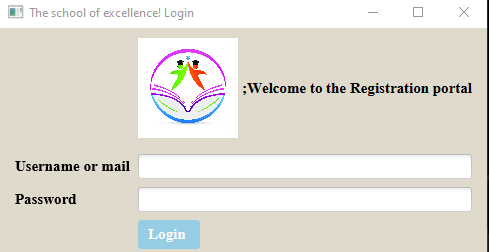
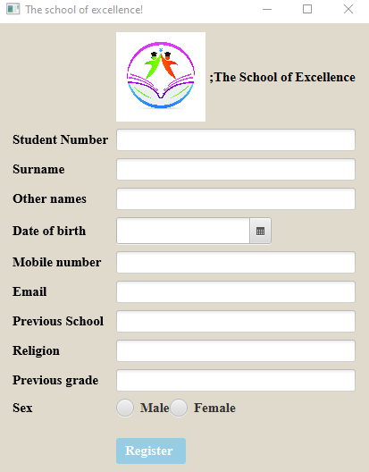

# CAT2_Miniproject
When the client side is ran, the following , login form will show up.
 
After signing in, the access to add a student to the system will be granted by sgowing up the following form 

